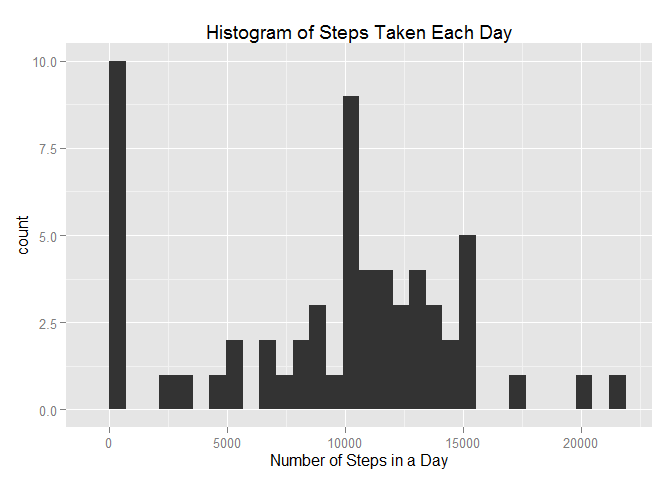
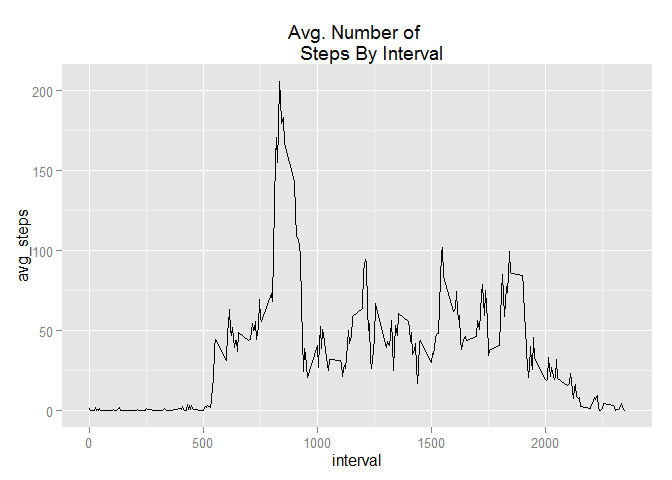
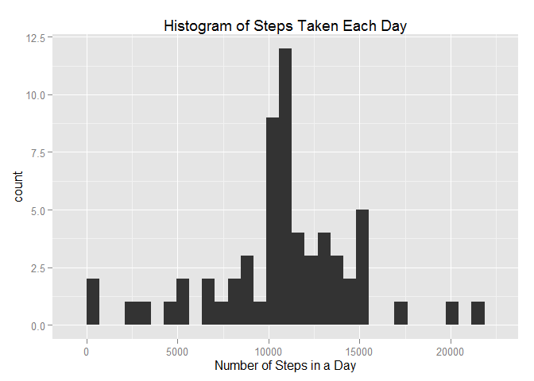
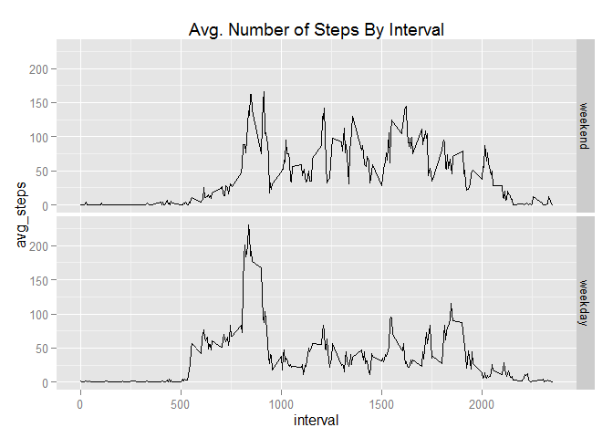

# Reproducible Research: Peer Assessment 1

This is an R Markdown document, for the Peer Assessment #1 of the Reproducible
Research Coursera.org course. It performs an analysis an activity monitoring 
device.

## Loading and preprocessing the data
Load the activity.csv file. We assume that the file is in your working 
directory.

```r
dat <- read.csv("activity.csv", header=T, na.strings="NA")
str(dat)
```

```
## 'data.frame':	17568 obs. of  3 variables:
##  $ steps   : int  NA NA NA NA NA NA NA NA NA NA ...
##  $ date    : Factor w/ 61 levels "2012-10-01","2012-10-02",..: 1 1 1 1 1 1 1 1 1 1 ...
##  $ interval: int  0 5 10 15 20 25 30 35 40 45 ...
```

Doing some quick data exploratory data analysis we see that there are a number 
of missing values.

```r
sum(is.na(dat))
```

```
## [1] 2304
```

Additionally, we are going to load a couple of packages that we are likely to 
use in this analysis.

```r
library(dplyr)
```

```
## Warning: package 'dplyr' was built under R version 3.2.2
```

```
## 
## Attaching package: 'dplyr'
## 
## The following objects are masked from 'package:stats':
## 
##     filter, lag
## 
## The following objects are masked from 'package:base':
## 
##     intersect, setdiff, setequal, union
```

```r
library(ggplot2)
```


## What is mean total number of steps taken per day?
To answer this question we first use the "dplyr" package to determine the number
of steps taken each day while ignoring the missing values.

```r
by_day <- group_by(dat, date) %>% summarize(num_steps=sum(steps, na.rm=TRUE))
head(by_day)
```

```
## Source: local data frame [6 x 2]
## 
##         date num_steps
## 1 2012-10-01         0
## 2 2012-10-02       126
## 3 2012-10-03     11352
## 4 2012-10-04     12116
## 5 2012-10-05     13294
## 6 2012-10-06     15420
```

We plot a histogram of the steps taken, next.

```r
qplot(by_day$num_steps, xlab="Number of Steps in a Day", 
      main="Histogram of Steps Taken Each Day")
```

```
## stat_bin: binwidth defaulted to range/30. Use 'binwidth = x' to adjust this.
```

 

Next, using the number of steps taken each day we determine the mean and median.

```r
mean_and_median = data.frame("mean"=mean(by_day$num_steps),
                           "median"=median(by_day$num_steps))
head(mean_and_median)
```

```
##      mean median
## 1 9354.23  10395
```


## What is the average daily activity pattern?
To answer this question we first group the number of steps by the interval in 
which they occurred.

```r
by_interval <- group_by(dat, interval) %>% summarize(avg_steps=mean(steps, 
                                                                    na.rm=TRUE))
```

Next we plot the average steps by the time interval

```r
qplot(interval, avg_steps, data=by_interval, geom="line", main="Avg. Number of 
      Steps By Interval")
```

 

It's clear from the plot that the most active interval occurs around the 800
interval. However, lets see if we can find the exact max interval below.

```r
m = max(by_interval$avg_steps)
filter(by_interval, avg_steps == m)
```

```
## Source: local data frame [1 x 2]
## 
##   interval avg_steps
## 1      835  206.1698
```


## Imputing missing values
Lets find the total number of missing values in the dataset for the number of steps.

```r
sum(is.na(dat$steps))
```

```
## [1] 2304
```

Lets fill in the missing steps with the mean of their 5 min. interval and save 
it in our new variable "**dat2**"

```r
dat2 <- dat
n = nrow(dat2)
for (i in 1:n){
    if (is.na(dat$steps[i])){
        dat2$steps[i] <- as.numeric( filter(by_interval, 
                                            interval == dat$interval[i]) %>% 
                                                        select(avg_steps)
                            )
    }
}
```
Lets double check that we have removed all of the missing values. It looks like
there are no more missing values.

```r
sum(is.na(dat2$steps))
```

```
## [1] 0
```

We now recreate the histogram and determine the mean and median of our new 
dataset

```r
by_day <- group_by(dat2, date) %>% summarize(num_steps=sum(steps, na.rm=TRUE))

qplot(by_day$num_steps, xlab="Number of Steps in a Day", 
      main="Histogram of Steps Taken Each Day")
```

```
## stat_bin: binwidth defaulted to range/30. Use 'binwidth = x' to adjust this.
```

 

```r
mean_and_median = data.frame("mean"=mean(by_day$num_steps),
                           "median"=median(by_day$num_steps))
print(mean_and_median)
```

```
##       mean   median
## 1 10766.19 10766.19
```
The values differ from those we looked at originally. Both the mean and median 
have increased using the dataset with no missing values. 


## Are there differences in activity patterns between weekdays and weekends?
To investigate this question we first create a new factor variable if the 
observation is during a weekday or weekend.

```r
weekend_days = c("Saturday","Sunday")
dat3 <- mutate(dat2, day=factor( (weekdays(as.Date(date)) %in% weekend_days),
                                levels=c(TRUE,FALSE), 
                                labels=c("weekend","weekday")
                                )
               )
```

Now lets create a panel plot of the avg_number of steps by interval broken out 
by weekend vs. weekday.

```r
by_day_interval <- group_by(dat3, day, interval) %>% 
                    summarize(avg_steps=mean(steps))

qplot(interval, avg_steps, data=by_day_interval, geom="line", 
      main="Avg. Number of Steps By Interval", facets=day~.)
```

 

During the weekday there is a large peak in the average number of steps taken early in the morning compared to the weekend, which has larger average number of
steps taken throughout the day. The large peak during the weekday is likely the 
person heading to work.
